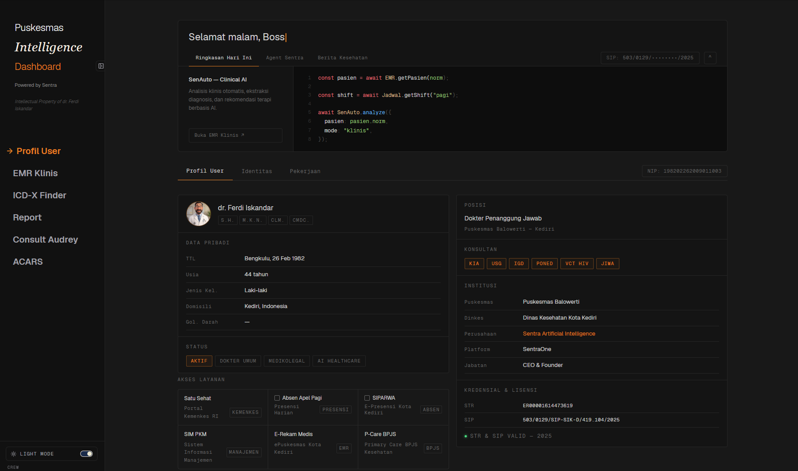

# Puskesmas Intelligence Dashboard

**Clinical Information System for Primary Healthcare Facilities**

Architect & Built by Claudesy

---

## Overview

Puskesmas Intelligence Dashboard is an internal operations portal purpose-built for UPTD Puskesmas PONED Balowerti, Kota Kediri. The system consolidates clinical workflows, regulatory reporting, diagnostic intelligence, and real-time communication into a single unified interface designed for use by medical staff in a primary healthcare (FKTP) environment.

The platform is a product of **Sentra Healthcare Solutions**, founded by **dr. Ferdi Iskandar**, and operates under the principle: *"Technology enables, but humans decide."*

## Technology Stack

| Layer | Technology |
|---|---|
| Framework | Next.js 16.1 (App Router) |
| Language | TypeScript (strict mode) |
| Runtime | Node.js >= 20.9.0 |
| UI Library | React 19.2 |
| Font System | Geist Sans / Geist Mono |
| Icons | Lucide React |
| Real-time | Socket.IO (custom HTTP server) |
| AI / Voice | Google Gemini 2.5 Flash (native audio) |
| Browser Automation | Playwright |
| Spreadsheet I/O | SheetJS (xlsx) |
| Deployment | Railway (Nixpacks) |

## Features

### User Profile Dashboard
Home view displaying logged-in crew member information, quick-links to government health portals (Satu Sehat, SIPARWA, ePuskesmas, P-Care BPJS), and a clinical patient data overview with vitals, ICD-X coding, and treatment history.

### EMR Auto-Fill Engine
Playwright-driven RPA engine that transfers structured clinical data (anamnesis, diagnosis, prescriptions) into the ePuskesmas electronic medical record system. Communicates progress to the frontend in real-time over Socket.IO.

### ICD-X Finder
Multi-version ICD-10 lookup tool supporting the 2010, 2016, and 2019 catalogs with dynamic search, fuzzy matching, and legacy code translation.

### LB1 Report Automation
End-to-end pipeline that ingests exported visit data from ePuskesmas, normalizes and validates records, maps ICD-10 codes to the national LB1 template, and outputs the completed Excel report along with a QC CSV of rejected records and a JSON summary file.

### Audrey -- Clinical Consultation AI
Voice-first clinical assistant powered by Google Gemini Live (native audio). Operates as a real-time conversational copilot for doctors during patient encounters, providing concise diagnostic insights calibrated for Puskesmas-level resources and constraints.

### ACARS -- Internal Chat
Socket.IO-backed team messaging system with room-based conversations, typing indicators, and online presence tracking.

### CDSS -- Clinical Decision Support
API-driven diagnostic suggestion engine combining a local disease knowledge base (159 diseases, 45,030 real encounter records) with Gemini-powered reasoning to provide ranked differential diagnoses, treatment plans, and referral criteria.

### Crew Access Portal
Authentication gate requiring crew credentials before any dashboard access. Session management uses HMAC-signed cookies with a 12-hour TTL. Credentials are sourced from environment variables, a runtime JSON file, or compiled defaults (in that priority order).

## Project Structure

```
healthcare-dashboard/
|-- server.ts                  # Custom HTTP + Socket.IO server
|-- next.config.ts             # Next.js configuration
|-- tsconfig.json              # TypeScript configuration
|-- railway.toml               # Railway deployment configuration
|-- package.json               # Dependencies and scripts
|-- src/
|   |-- app/
|   |   |-- layout.tsx         # Root layout (ThemeProvider + CrewAccessGate + AppNav)
|   |   |-- page.tsx           # Home / User Profile dashboard
|   |   |-- globals.css        # Global CSS with dark/light theme tokens
|   |   |-- emr/               # EMR Auto-Fill interface
|   |   |-- icdx/              # ICD-X lookup page
|   |   |-- report/            # LB1 report generation page
|   |   |-- voice/             # Audrey voice consultation page
|   |   |-- acars/             # Internal chat page
|   |   |-- chat/              # Chat contacts prototype
|   |   |-- pasien/            # Patient records page
|   |   |-- api/
|   |       |-- auth/          # Login, logout, session endpoints
|   |       |-- cdss/          # Clinical decision support API
|   |       |-- emr/           # EMR transfer run/status/history
|   |       |-- icdx/          # ICD-10 lookup API
|   |       |-- report/        # LB1 automation API (run, status, history, files)
|   |       |-- voice/         # TTS, chat, token endpoints
|   |       |-- news/          # Health news API
|   |       |-- perplexity/    # Perplexity AI integration
|   |-- components/
|   |   |-- AppNav.tsx         # Sidebar navigation
|   |   |-- CrewAccessGate.tsx # Authentication gate component
|   |   |-- ThemeProvider.tsx  # Dark/light theme context
|   |   |-- ui/               # Shared UI components
|   |-- lib/
|       |-- crew-access.ts     # Shared auth types and constants
|       |-- server/            # Server-only auth logic
|       |-- lb1/              # LB1 report engine (config, transform, IO, template writer)
|       |-- emr/              # EMR auto-fill engine (orchestrator, handlers, Playwright)
|       |-- icd/              # ICD-10 dynamic database
|-- docs/
|   |-- plans/                # Design documents
|-- runtime/                  # Runtime configuration files (not committed)
```

## Getting Started

### Prerequisites

- Node.js 20.9.0 or later
- npm

### Installation

```bash
git clone <repository-url>
cd healthcare-dashboard
npm install
```

### Environment Configuration

Create a `.env.local` file in the project root with the following variables:

```bash
# Server
PORT=7000

# Authentication
CREW_ACCESS_SECRET=<random-secret-for-production>
CREW_ACCESS_USERS_JSON='[{"username":"...","password":"...","displayName":"..."}]'

# Google Gemini (for Audrey and CDSS)
GEMINI_API_KEY=<your-gemini-api-key>

# LB1 Report Engine
LB1_PROJECT_ROOT=<path-to-lb1-project>
LB1_HISTORY_FILE=<path-to-history-json>

# EMR / RME Credentials (do not commit)
# RME_BASE_URL, RME_USERNAME, RME_PASSWORD
```

### Running the Development Server

```bash
npm run dev
```

This starts the custom server (`tsx server.ts`) with Socket.IO support on `http://localhost:7000`.

To run Next.js in standard dev mode (without the custom server):

```bash
npm run dev:next
```

### Building for Production

```bash
npm run build
npm run start
```

## Available Scripts

| Script | Description |
|---|---|
| `npm run dev` | Start custom server with Socket.IO via tsx |
| `npm run dev:clean` | Clear dev lock file and start custom server |
| `npm run dev:next` | Start Next.js dev server without custom server |
| `npm run build` | Build production bundle |
| `npm run start` | Start production server via custom server |

## API Reference

### Authentication
- `POST /api/auth/login` -- Authenticate with crew credentials
- `POST /api/auth/logout` -- End current session
- `GET /api/auth/session` -- Validate current session

### LB1 Report Automation
- `GET /api/report/automation/status` -- Current automation engine status
- `POST /api/report/automation/run` -- Execute LB1 pipeline
- `GET /api/report/automation/history?limit=30` -- Pipeline execution history
- `GET /api/report/automation/preflight` -- Pre-run validation checks
- `GET /api/report/files` -- List generated output files
- `GET /api/report/files/download` -- Download a generated file

### EMR Transfer
- `POST /api/emr/transfer/run` -- Execute EMR auto-fill
- `GET /api/emr/transfer/status` -- Transfer engine status
- `GET /api/emr/transfer/history` -- Transfer execution history

### Clinical
- `POST /api/cdss/diagnose` -- Run CDSS diagnostic suggestion
- `GET /api/icdx/lookup` -- ICD-10 code search

### Voice
- `POST /api/voice/chat` -- Voice chat endpoint
- `POST /api/voice/tts` -- Text-to-speech
- `GET /api/voice/token` -- Session token for voice

## Deployment

The application is configured for deployment on **Railway** using Nixpacks:

```toml
[build]
builder = "nixpacks"
buildCommand = "npm run build"

[deploy]
startCommand = "npm run start"
restartPolicyType = "on_failure"
restartPolicyMaxRetries = 3
```

Required environment variables must be set in the Railway dashboard. Refer to the Environment Configuration section above.

## Related Documentation

- [ARCHITECTURE.md](./ARCHITECTURE.md) -- System architecture and component design
- [CONTRIBUTING.md](./CONTRIBUTING.md) -- Development workflow and code conventions
- [CHANGELOG.md](./CHANGELOG.md) -- Version history
- [SECURITY.md](./SECURITY.md) -- Security policy and vulnerability reporting
- [CODE_OF_CONDUCT.md](./CODE_OF_CONDUCT.md) -- Code of conduct
- [SERVER_GUIDE.md](./SERVER_GUIDE.md) -- Server operation and troubleshooting guide
- [CLAUDE.md](./CLAUDE.md) -- AI assistant conventions and guidelines

## License

This software is proprietary and confidential.
Copyright (c) 2025-2026 Sentra Healthcare Solutions. All rights reserved.
See [LICENSE](./LICENSE) for details.

---

Architect & Built by Claudesy
